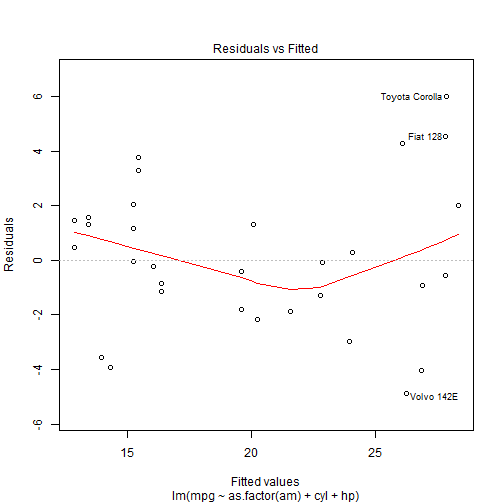
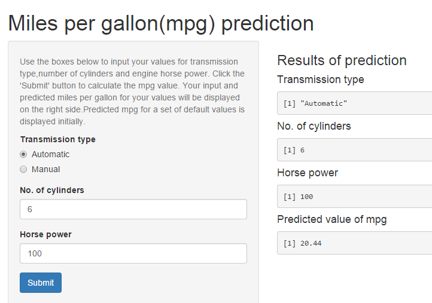

Car performance estimator
========================================================
author: Krupa Shah
date: 20 Jul 2015
transition: fade
transition-speed: slow
Tool Features 
========================================================

Mpg prediction application is a very handy tool for estimating the performance of your car. Some important features are :

- User friendly interface
- Only basic inputs required from user - transmission type, engine horse power and number of cylinders
- Uses the most advanced statistical methods to calculate the average miles per gallon (mpg) of your car
- Simplified result displayed along with your car parameters

Tool Specifications
========================================================

- Radio buttons for inputting transmission type of car
- Numeric boxes with selection arrows to select a value from a preset range of values for engine horse power and number of cylinders
- Submit button for calculating the predicted miles per gallon for the car
- Result rounded off to two decimal places

Tool accuracy
========================================================
The prediction tool is very accurate, as can be seen from the graph below.

 

Tool screen shot
========================================================

